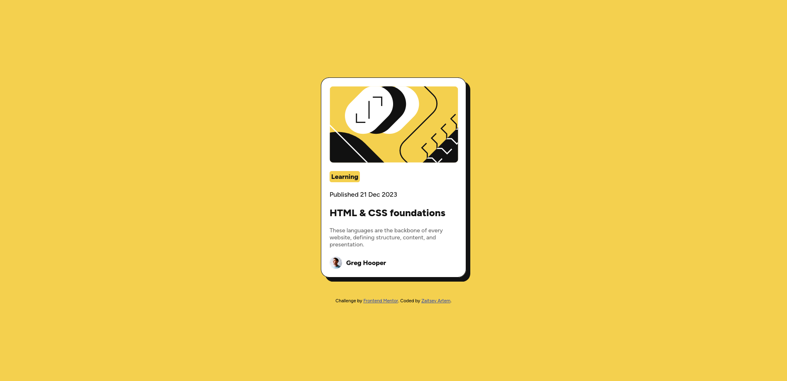

# Frontend Mentor - Blog preview card solution

This is a solution to the [Blog preview card challenge on Frontend Mentor](https://www.frontendmentor.io/challenges/blog-preview-card-ckPaj01IcS). Frontend Mentor challenges help you improve your coding skills by building realistic projects.

## Table of contents

- [Overview](#overview)
  - [The challenge](#the-challenge)
  - [Screenshot](#screenshot)
  - [Links](#links)
- [My process](#my-process)
  - [Built with](#built-with)
  - [What I learned](#what-i-learned)

## Overview

### The challenge

Users should be able to:

- See hover and focus states for all interactive elements on the page

### Screenshot




### Links

- Solution URL: [Click](https://github.com/Aldeimeter/FrontendMentorChallenges)
- Live Site URL: [Click](https://aldeimeter.github.io/FrontendMentorChallenges/blog-preview-card-main/index.html)

## My process

### Built with

- Semantic HTML5 markup
- CSS custom properties
- Flexbox
- Mobile-first workflow

### What I learned

I learned to combine max-width and relative width to make component responsive for screens 320px wide

```css
.blog-card {
  margin: 0 auto;
  padding: 20px;
  background: var(--white);
  border: 1px solid var(--gray-950);
  box-shadow: 10px 10px 0px 0px var(--gray-950);
  border-radius: 20px;
  max-width: 350px;
  width: 90%;
  display: flex;
  flex-direction: column;
  justify-content: center;
  align-items: start;
  gap: 20px;
}
```
